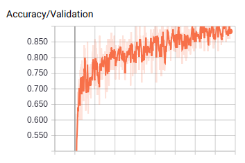
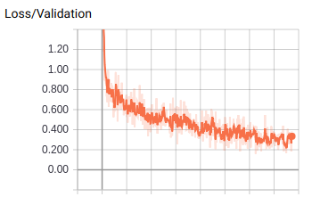
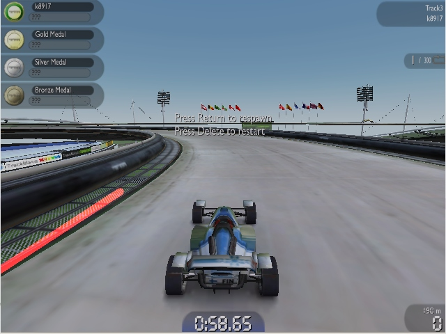
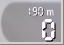

## Computer driven car in a simulated environment

### Problem
Create a computer driven car in a simulated environment e.g. a videogame. My choices were limited having no budget to buy games and Linux having a small selection of free games to choose from. I chose TrackMania Nations Forever for it's features and relatively simple controls.

### Approaches
- Emulate self-driving cars from the real world, use line- or edge detection to find drivable lanes. Try using object detection?
- Use convolutional neural networks to teach a model to predict actions from images. I decided to use Google's Inception V3 convolutional neural network.

### Results
First approach had some issues, mostly related to this game in particular. The drivable lanes in game are very wide, making it hard to reliably detect them. I decide to not pursue this approach further because of problems mentioned previously.

Second approach had some issues, mostly related to the lack of diversity in the training data or the small quantity of it. Despite these issues, I managed to make progress with this approach, creating a computer driven car that performs respectably.

I was able to achieve aproximately 86% accuracy with a convolutional neural network.

##### Observations
I noticed while training the convolutional neural networks that some datasets have significantly lower accuracy for both training and validation subsets. I suspect outliers in the datasets. Trying to remove these outliers would be very time consuming and difficult. I decided to not do this and try to gather more valid data.

### Images
Some graphs from Tensorboard.

##### Validation accuracy 

##### Validation loss 

### Videos
- [Trained track](https://youtu.be/CAi4YIlSLm0)
- [Untrained track](https://youtu.be/S2kOVLtNqkg)
 
As we can see the model performs significantly worse in an untrained environment. It still managed to make it through most of the track. 

### Shortcomings & Problems
Lack of training data and the nature of it made it very difficult to train a reliable model. I didn't balance the data due to time constraints, this might prevent bias towards specific directions. I tried to combat this by reversing a training track.

### Improvements & Potential
My thoughts on how to improve the solution.

##### Use the lane detection and line slopes from the first approach to determine speed and turns?
May be a good idea to combine lane detection and line slopes to determine turns. It would open up possibilities for different predictive neural networks. This may be worth pursuing.

###### Hough lines for edge detection.

##### Use a secondary convolutional network to monitor and adjust speed of the car?
I don't know of a way to hook into the game's data. It would be possible to take an image of the speed in game, then teach a neural network to determine the current speed and adjust it correctly.

##### Use more data from all terrains and situations to create a more reliable training dataset?
I only had 100 thousand frames of data, from one type of terrain and daylight setting. Having every type of terrain and daylight setting would increase the diversity of the dataset.

##### Using object detection and edge detection to determine the position of the car?
Considering the view of the game, it would be possible to detect the car X and Y coordinates on screen. Use edge detection to get the drivable lane, then teach a neural network to stay within the lane.

##### Apply reinforcement learning to improve the model?
This is worth pursuing, making the model require less user generated training data in the long run.

##### Other ideas
I thought about applying a genetic algorithm to incrementally improve the model.

### Sources & Inspiration
- https://github.com/Sentdex/pygta5

### Additional Info
- You can find the lane finding code in v0.01 folder.

##### Dependencies & Versions
- mss 3.2.1
- pynput 1.3.10
- tflearn 0.3.2
- tensorflow-gpu 1.8.0
- numpy 1.14.5
- opencv-python 3.4.1